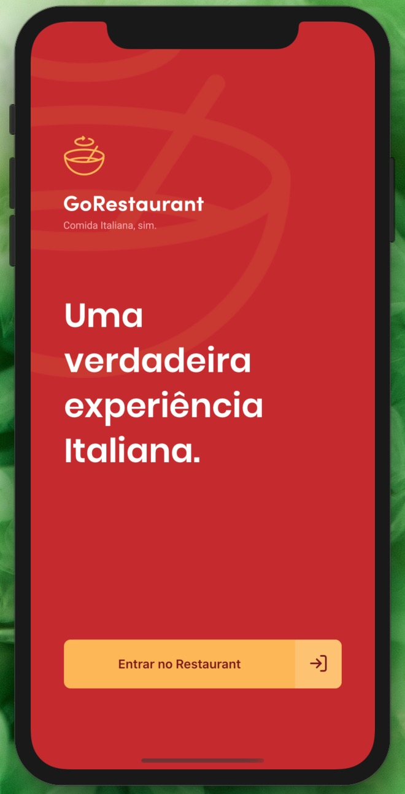
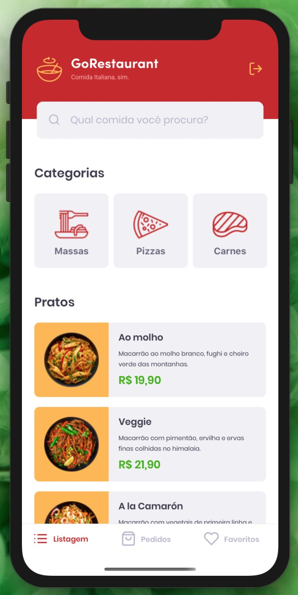
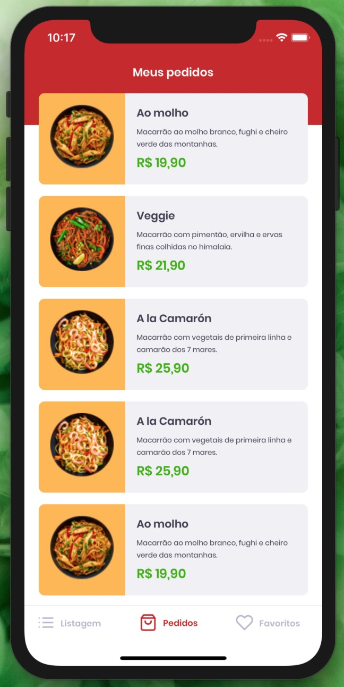
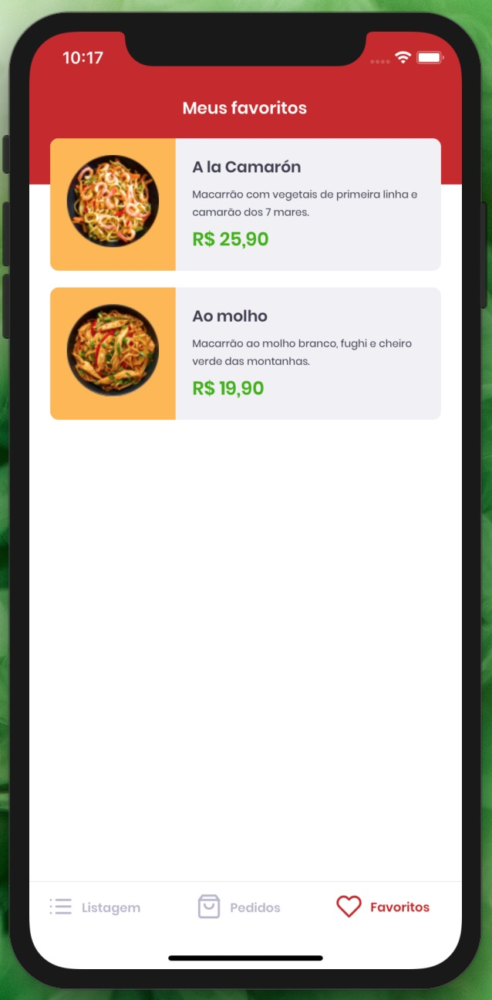
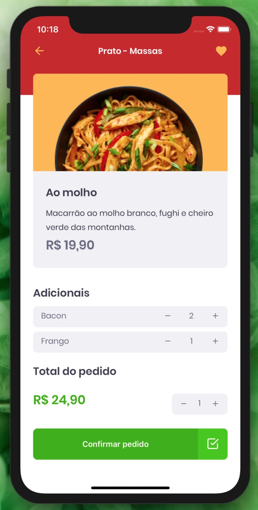
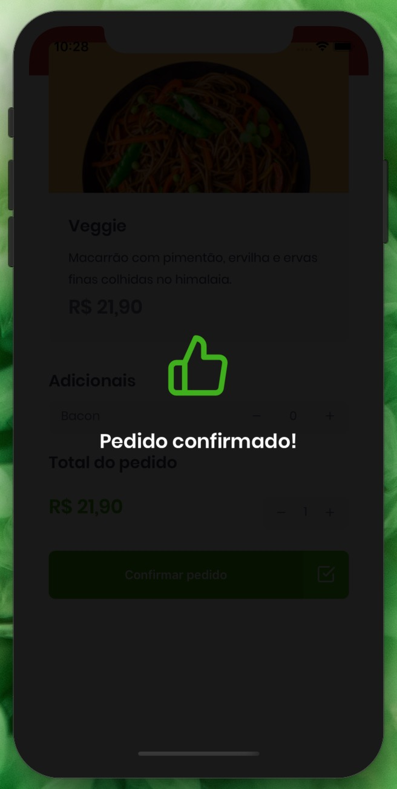

<h1 align="center">
    
      GoStack Bootcamp 
    ReactJS | React Native | NodeJS
</h1>

  

  

  

  

   

  

  

  

  <a href="#bookmark-about">About</a>&nbsp;&nbsp;&nbsp;|&nbsp;&nbsp;&nbsp;
  <a href="#rocket-dependencies">Dependencies</a>&nbsp;&nbsp;&nbsp;|&nbsp;&nbsp;&nbsp;
  <a href="#link-links">Links</a>

 

  
  
  
   
  
  
  

 

## :bookmark: About

React Native mobile application developed during the GobStack Bootcamp. It allows providers and clients to register an account and manage/schedule appointments.

## :floppy_disk: Dependencies

-  [NodeJS](https://nodejs.org/en/) - v12.17.0
-  [ReactJS](https://reactjs.org/) - v16.11.0
-  [React Native](https://reactnative.dev/) - v0.62.2
-  [Typescript](https://www.typescriptlang.org/) - v3.8.3

## :link: Links

- [GoRestaurant - ReactJS](https://github.com/marina-ferreira/go-restaurant)
